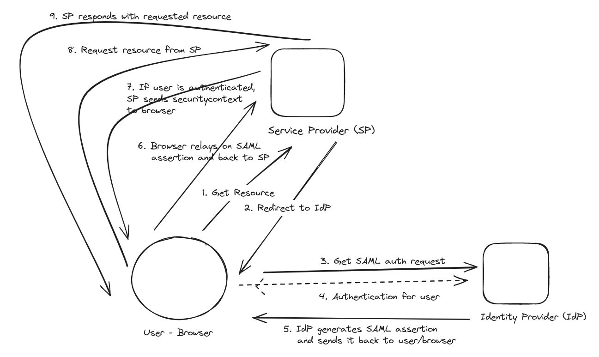

# WIP

### What is SAML? (1*)

- Security Assertion Markup Language (SAML) is a login standard that helps users access applications based on sessions in another context.

- It’s a single sign-on (SSO) login method.

### How does it works? (2*)

### Resources

1* https://auth0.com/resources/ebooks/saml-authentication-explained

2* https://auth0.com/blog/how-saml-authentication-works/
